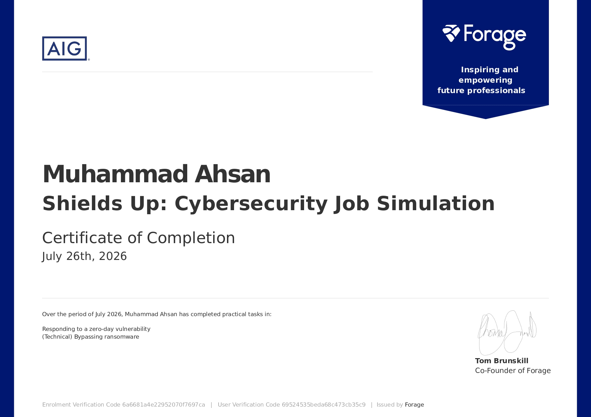

# Certifications

## AIG Shields Up: Cybersecurity Job Simulation — Forage

## 📌 Role

**Information Security Analyst** — Cyber & Information Security Team, AIG (simulated engagement via Forage)

## About the Simulation

This certificate was awarded for completing AIG's **Shields Up: Cybersecurity Job Simulation**, hosted on Forage. The simulation places you in the role of an **Information Security Analyst** on AIG's **Cyber & Information Security Team**, responding to a realistic, evolving security incident — from initial vulnerability discovery through to ransomware incident response and recovery.

## Tasks Completed

| Task | Focus | What It Involved |
|---|---|---|
| **1. Vulnerability Investigation** | Log4Shell (CVE-2021-44228) | Investigating and reporting on the Apache Log4j vulnerability affecting company infrastructure |
| **2. Ransomware Incident Response** | Data recovery without paying the ransom | Writing a Python brute-force tool to recover a ransomware-encrypted archive after an attacker exploited the unpatched vulnerability |

## What I Learned

- **Vulnerability assessment** — how to investigate and report on a real, high-severity CVE (Log4Shell) and understand its exploitation path
- **Ransomware incident response** — the operational process a security team follows once ransomware is detected and partially contained, including coordination with detection & response teams
- **Ransom payment decision-making** — the business and security reasoning behind a CISO's decision not to pay a ransom (no guarantee of a working key, risk of repeat targeting, funding future attacks)
- **Brute-force password recovery** — practical implementation of a dictionary-attack approach to recover encrypted data using a known password wordlist
- **Python for security tooling** — file handling, exception handling, and control flow applied specifically to a security/incident-response use case
- **Password hygiene lessons** — firsthand demonstration of why common/reused passwords (as catalogued in leaked lists like RockYou) represent a serious organizational risk

## Skills Demonstrated

`Vulnerability Assessment` · `Ransomware Incident Response` · `Python Scripting` · `Password Cracking Methodology` · `Brute-Force Techniques` · `Data Recovery` · `Security Risk Decision-Making` · `Technical Documentation`

## Certificate Details

| Field | Detail |
|---|---|
| **Program** | Shields Up: Cybersecurity Job Simulation |
| **Issuing Company** | AIG, via Forage |
| **Simulated Role** | Information Security Analyst — Cyber & Information Security Team |

> This certificate reflects completion of a **simulated** security incident response engagement, not a real-world AIG deployment or actual breach.

